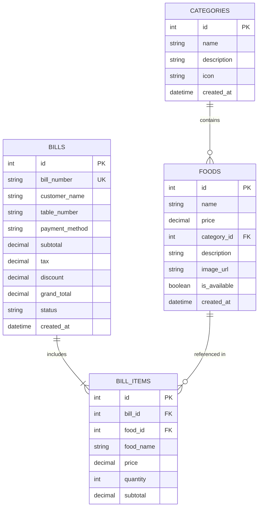

# 🗄️ Entity Relationship Diagram (ERD) & Database Schema

This document details the relational database schema used for the **Restaurant Management Web Application**.

---

## 📊 Entity Relationship Diagram (Mermaid)

---

## 📋 Table Specifications

### 1. `categories` Table
Stores food categories (e.g. Starters, Main Course, Fast Food, Desserts, Beverages).

| Column | Type | Constraints | Description |
| :--- | :--- | :--- | :--- |
| `id` | INT | PRIMARY KEY, AUTO_INCREMENT | Unique category identifier |
| `name` | VARCHAR(100) | NOT NULL, UNIQUE | Category display name |
| `description` | TEXT | NULLABLE | Category description |
| `icon` | VARCHAR(50) | DEFAULT '🍽️' | Emoji or icon class |
| `created_at` | TIMESTAMP | DEFAULT CURRENT_TIMESTAMP | Creation timestamp |

### 2. `foods` Table
Stores food menu items.

| Column | Type | Constraints | Description |
| :--- | :--- | :--- | :--- |
| `id` | INT | PRIMARY KEY, AUTO_INCREMENT | Unique food item identifier |
| `name` | VARCHAR(150) | NOT NULL | Food item name |
| `price` | DECIMAL(10,2) | NOT NULL | Selling price |
| `category_id` | INT | FOREIGN KEY (`categories.id`) | Linked category |
| `description` | TEXT | NULLABLE | Food description |
| `image_url` | VARCHAR(500)| NULLABLE | Thumbnail photo URL |
| `is_available` | TINYINT(1) | DEFAULT 1 | 1 = In Stock, 0 = Out of Stock |
| `created_at` | TIMESTAMP | DEFAULT CURRENT_TIMESTAMP | Creation timestamp |

### 3. `bills` Table
Stores generated bill invoices.

| Column | Type | Constraints | Description |
| :--- | :--- | :--- | :--- |
| `id` | INT | PRIMARY KEY, AUTO_INCREMENT | Internal bill ID |
| `bill_number` | VARCHAR(50) | NOT NULL, UNIQUE | Human-readable invoice number (e.g., `INV-82910-4102`) |
| `customer_name`| VARCHAR(100) | DEFAULT 'Walk-in Customer' | Customer name |
| `table_number` | VARCHAR(20) | DEFAULT 'T-1' | Table / Order reference |
| `payment_method`| VARCHAR(50) | DEFAULT 'Cash' | Payment mode (Cash, Card, UPI) |
| `subtotal` | DECIMAL(10,2) | NOT NULL | Total items price before tax |
| `tax` | DECIMAL(10,2) | DEFAULT 0.00 | Applied tax amount |
| `discount` | DECIMAL(10,2) | DEFAULT 0.00 | Applied discount amount |
| `grand_total` | DECIMAL(10,2) | NOT NULL | Final bill amount payable |
| `status` | VARCHAR(20) | DEFAULT 'Paid' | Order status |
| `created_at` | TIMESTAMP | DEFAULT CURRENT_TIMESTAMP | Invoice generation timestamp |

### 4. `bill_items` Table
Stores line items for each generated bill invoice.

| Column | Type | Constraints | Description |
| :--- | :--- | :--- | :--- |
| `id` | INT | PRIMARY KEY, AUTO_INCREMENT | Unique line item ID |
| `bill_id` | INT | FOREIGN KEY (`bills.id`) | Parent bill reference |
| `food_id` | INT | FOREIGN KEY (`foods.id`) | Ordered food item reference |
| `food_name` | VARCHAR(150) | NOT NULL | Snapshot food name |
| `price` | DECIMAL(10,2) | NOT NULL | Unit price at time of bill |
| `quantity` | INT | NOT NULL | Quantity ordered |
| `subtotal` | DECIMAL(10,2) | NOT NULL | `price * quantity` |
